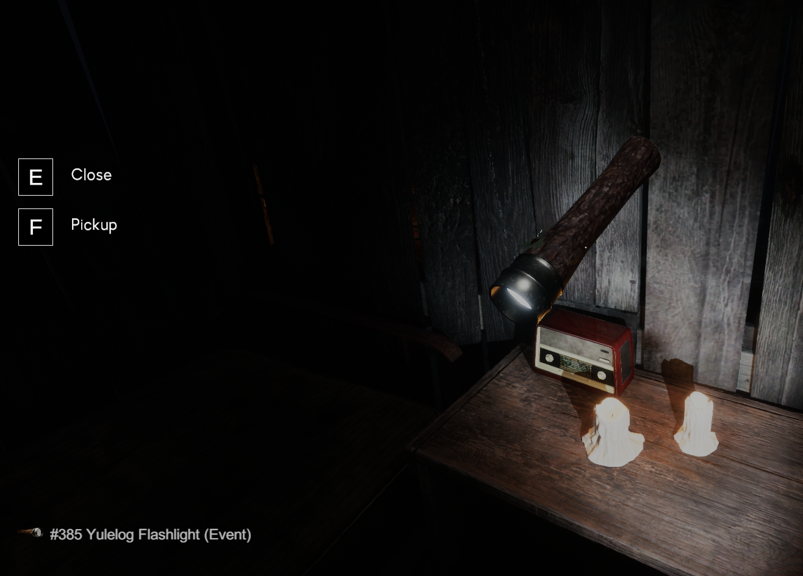
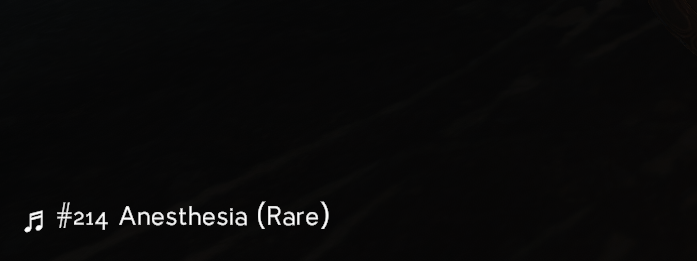
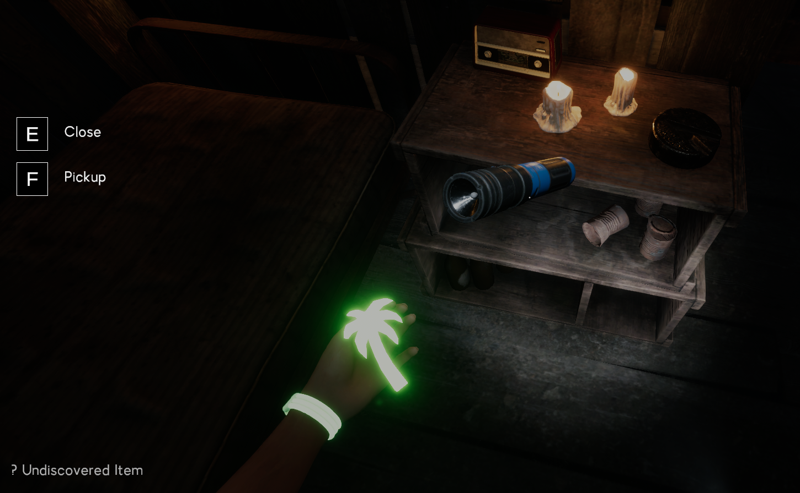
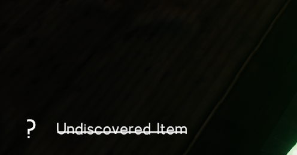
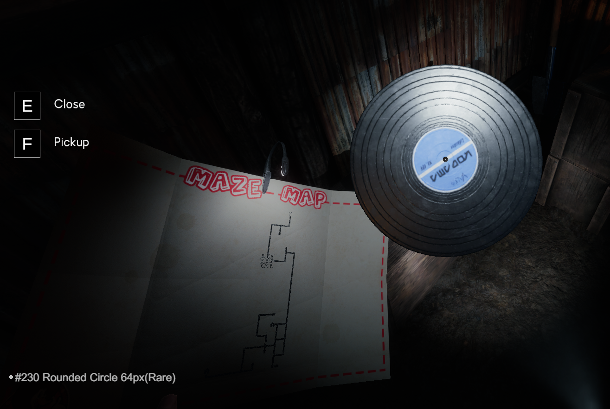

# Labyrinthine - Tell Me Cosmetics
`Press Tab` to display what cosmetics will get in-game.
### Case: Discovered item

### Case: Discovered music item

### Case: Undiscovered item when `RevealAllItems=false`

### Case: When picked up



## Get Started
1. Download and install [MelonLoader](https://melonwiki.xyz) (Must v0.7.0+)
2. Download the latest mod `.dll` [RELEASE](https://github.com/limitbrk/Labyrinthine-TellMeCosmetics/releases/latest) (Recommend v0.1.0+)
3. Copy `.dll` into the folder `Mods` in the game folder.


## Mod Setting
When game started onces. Please close game. Then file `Mods/TellMeCosmetics_config.cfg` will created with these setting
```ini
[Gameplay]
RevealAllItems = false
```
- `RevealAllItems`: Show every item name include undiscovered (Default is `false`)

&nbsp;

(Optional) to hide **MelonLoader** process you can set Launch Option as...
```yaml
--melonloader.disablestartscreen --melonloader.hideconsole
```

  - `--melonloader.disablestartscreen`: Disable Melon Loader Splash Screen
  - `--melonloader.hideconsole`: Disable Console Popup (Still save logs)

## Mod Status
**ONLY Tested on Windows 11 AMDx64** 

## Features Plan
- [x] **Display Case's Cosmetics item** - From ~~Cases board~~ Labyrinth Map
- [x] **Show Item Name** - That really name not itemID
- [x] **Show Image of Cosmetics Item** - only item name don't know how it's look
- [X] **Masked Locked Items** - For Non-OP mods
- [X] **Mark UI when picked up** - For who often forget you have picked it?
- ~~**(Cancelled) Tweak UI** - more readable~~ _(I'm lack Unity UI skill to made this)_
- ~~**(Cancelled) Animation** - Fade in / out?~~ 
- ~~**(Cancelled) GetItem from Lobby** - Know Item by seeds without loading world~~ _(too hard for me)_

## Known Issues
I'm not a Unity developer but I tried to search solution
- MelonLoader launch game too long...
- Mod's UI __Dissapeared__ when Recreated lobby
- ~~(Fixed) Disc show wrong itemname~~

- ~~(Fixed) Sometimes Crash~~
- ~~(Fixed) FrameDrop/Freezing sometimes when load map~~
- ~~(Fixed in ML v0.6.6) MelonLoader Make SteamUI Bug~~

&nbsp;
&nbsp;
# For Mod Developer
Here are details if you want to continue my job ;)

## Dev Requirement
- **ModLoader:** [MelonLoader](https://melonwiki.xyz) v0.6.6+
- **AssetSearch:** [UnityExplorer (Forked)](https://github.com/GrahamKracker/UnityExplorer) - Original not worked
- **RevEngCode:** [dnSpy](https://github.com/dnSpy/dnSpy)
- .Net SDK 6.0

## Build It Youself
1. **Assembly file:** Copy these files `MelonLoader` folder to repo `dlls`
```cs
- MelonLoader\Il2CppAssemblies\Assembly-CSharp.dll
- MelonLoader\Il2CppAssemblies\Il2Cppmscorlib.dll
- MelonLoader\Il2CppAssemblies\Unity.TextMeshPro.dll
- MelonLoader\Il2CppAssemblies\UnityEngine.CoreModule.dll
- Labyrinthine\MelonLoader\net6\Il2CppInterop.Runtime.dll
```
2. build at repo root by this command
```bash
$ dotnet build
```
3. You will get file at `bin\Debug\net6.0\TellMeCosmetics.dll` that can be copy to game `Mods` folder
 
## Knowledge Sharing
### Contract in "Lobby_PC" scene
`Il2CppRandomGeneration.Contracts.ContractUI` (UI)
`Il2CppRandomGeneration.Contracts.Contract` (data)
- Seed 
- SecondSeed
- ExcludedCustomizationItemIDs

*** Not found cosmetics selection logic from seed yet. (Behavior - **Re-Enter** map will same spawned)

### Cosmetic Item (Lobby)
`Il2CppCharacterCustomization.CustomizationItem`
- icon (Image)
- itemID (Reference ItemID)

### Cosmetic Item (In-game)
`Il2CppCharacterCustomization.CustomizationPickup`
- itemID (Reference ItemID)

### Optional - Save Check 
`Il2CppCharacterCustomization.CustomizationSave`
- IsItemUnlocked(Reference itemID)
