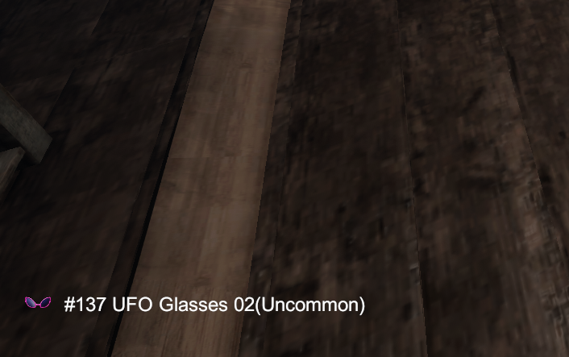

# Labyrinthine - Tell Me Cosmetics
`Press Tab` to display what cosmetics will get in-game.

## Get Started
- Download and install [MelonLoader](https://melonwiki.xyz) (Stil use [Alpha-Dev build](https://nightly.link/LavaGang/MelonLoader/workflows/build/alpha-development)) manually.

- Download the latest mod `.dll` [RELEASE](https://github.com/limitbrk/Labyrinthine-TellMeCosmetics/releases/latest)
- Copy `.dll` into the folder `Mods` in the game folder.

## Disclaimer
**ONLY Tested on Windows 11 Intelx64**

## Known Issues
I'm not a Unity developer but I tried to search solution
- ~~(Fixed) Sometimes Crash~~
- FrameDrop/Freezing sometimes ( IDK how to search GameObject without performance drop )
- MelonLoader Make SteamUI Bug ( wait they update -_- )

## Features Plan
- [x] **Display Case's Cosmetics item** - From ~~Cases board~~ Labyrinth Map
- [x] **Show Item Name** - That really name not itemID
- [x] **Show Image of Cosmetics Item** - item name don't know how it's look
- [ ] **Tweak UI** - more readable
- [ ] **Masked Locked Items** - For Non-OP mods
- [ ] **(Opt.) Animation** - Fade in / out?
- [ ] **(Opt.) Sound** - Reuse Game sound
- [ ] **(Cancelled) GetItem from Lobby** - Know Item by seeds without loading world _(too hard for me)_

&nbsp;
# For Mod Developer
Here are details if you want to continue my job ;)

## Dev Requirement
- **ModLoader:** MelonLoader (Stil use [Alpha-Dev build](https://nightly.link/LavaGang/MelonLoader/workflows/build/alpha-development))
- **AssetSearch:** [UnityExplorer (Forked)](https://github.com/GrahamKracker/UnityExplorer) - Original not worked
- **RevEngCode:** [dnSpy](https://github.com/dnSpy/dnSpy)
- .Net SDK 6.0
 
## Classes/Method
### [Intended to do] Know from Contract in "Lobby_PC" scene
`Il2CppRandomGeneration.Contracts.ContractUI` (UI)
`Il2CppRandomGeneration.Contracts.Contract` (data)
- Seed 
- SecondSeed
- ExcludedCustomizationItemIDs

*** Not found cosmetics selection logic from seed yet. (Behavior - **Re-Enter** map will same spawned)

### Cosmetic Item (Lobby)
`Il2CppCharacterCustomization.CustomizationItem`
- icon (Image)
- itemID (Reference ItemID)

### Cosmetic Item (In-game)
`Il2CppCharacterCustomization.CustomizationPickup`
- itemID (Reference ItemID)

### Optional - Save Check 
`Il2CppCharacterCustomization.CustomizationSave`
- IsItemUnlocked(Reference itemID)
